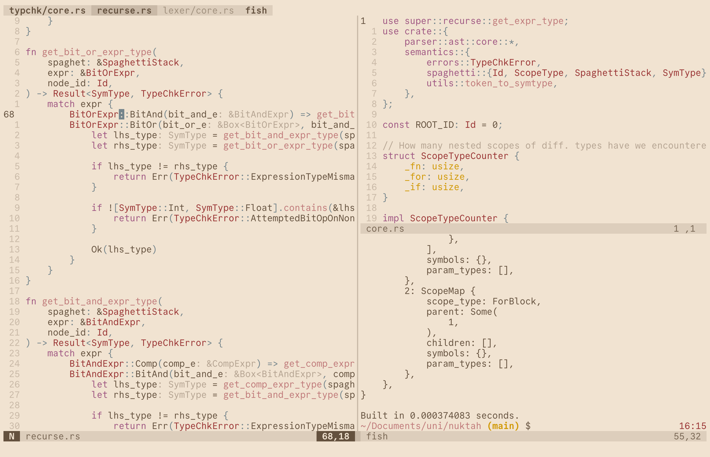

# Dotfiles



GNU Stow-consecrated talismans for an Arch-Wayland sanctum running Niri, a
plethora of TUI-focused arcana comprising (non-exhaustively) `tmux`, `fish`,
`zoxide`, `fzf`, `lf`, and `neovim`, and a grimoire's worth of keybinds coupled
w/ a cantankerous Kanata config; encrusted with eldritch runes that render mine
digital swamp's mana attunement significantly more conducive to nimble (and
delightfully whimsical) spell-casting.

## Setup

```bash
# Following a 'minimal' `archinstall`:
cd && git clone https://github.com/masroof-maindak/.dotfiles
cd .dotfiles
chmod +x bootstrap.sh
./bootstrap.sh
```

## After

### Username Hardcoding

> [!CAUTION]
>
> I have [configured](system/skip-username.conf) my TTY to automatically enter
> my username in the virtual console when logging in. To prevent the egregious
> inconvenience of always failing your first login attempt (unless your username
> is `maindak`), either modify the username in that file, or comment out the
> relevant line from `bootstrap.sh`.

The only other instance of username hardcoding (exluding Git configs & readmes;
at least as of the moment of writing) is for the [wgetrc](.config/wgetrc) that
prevents home-cluttering, but maybe run a `rg maindak` after cloning just to be
safe.

### Update Remote

```bash
cd ~/.dotfiles
git remote set-url origin git@github.com:masroof-maindak/.dotfiles.git
```

### Git SSH Signing

- Git config attempts to use `~/.ssh/id_ed25519.pub` as signing key
- Copy over previous/create new Git signing key

### Build From Source

- [`eww-niri-workspaces`](https://github.com/druskus20/eww-niri-workspaces) --
  required for the workspace indicator in my
  [Eww](https://github.com/elkowar/eww) bar
- ???

### Obsidian

- Start `syncthing` and set it up to sync the `~/Documents/Vault`,
  `~/Pictures/Image Transmission`, and `~/Music` directories with my phone.

### spotify-player

- Generate client ID and write to `~/.cache/spotify_client_id`.
- Follow instructions to authenticate.

### Kanata

- Follow the instructions in their
  [setup guide](https://github.com/jtroo/kanata/blob/main/docs/setup-linux.md).
- Whilst copying over the sample SystemD service, ensure the `Environment`
  variable under the `[Service]` heading contains the path of the `kanata`
  installation; this should be `/home/<user>/.local/share/cargo/bin`
